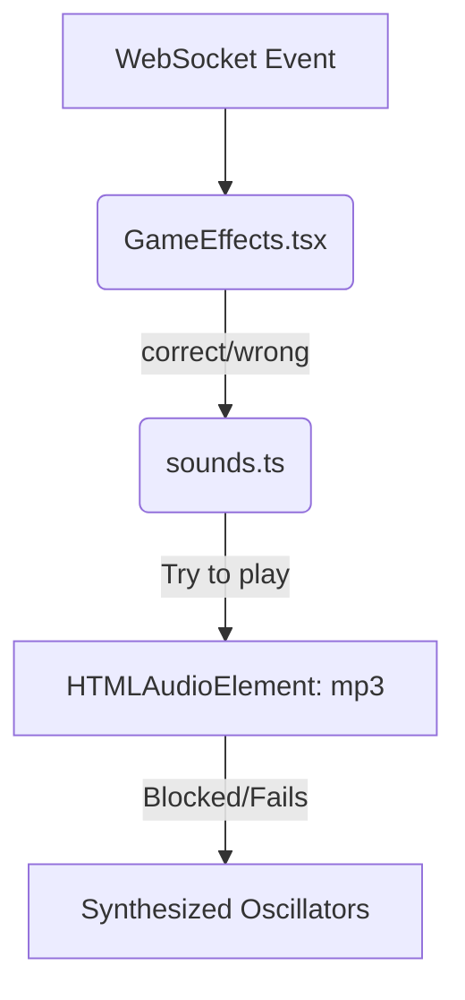

# Phase 01: Implement Sound Effects

## Context Links
*   Brainstorm Report: [brainstormer-260625-1407-correct-incorrect-sounds.md](file:///Users/vinhcuong/Dev/gala-game/plans/reports/brainstormer-260625-1407-correct-incorrect-sounds.md)
*   Target Sound Utility: [sounds.ts](file:///Users/vinhcuong/Dev/gala-game/frontend/src/lib/sounds.ts)
*   Effects Handler: [GameEffects.tsx](file:///Users/vinhcuong/Dev/gala-game/frontend/src/components/display/GameEffects.tsx)

## Overview
*   **Priority:** Medium
*   **Status:** Completed
*   **Goal:** Replace generated synthesized oscillator sounds with imported high-quality MP3 sound effects for correct and incorrect answers on the display screen.

## Key Insights
*   `sounds.ts` utilizes Web Audio API oscillators which are synthesized directly.
*   Importing `.mp3` files in Vite returns a string representation of the static asset URL.
*   Using standard `HTMLAudioElement` (`new Audio`) is the simplest way to play these assets.
*   We need a fallback to the old synthetic oscillators to prevent silence in case browser autoplay blocks the MP3 audio.

## Requirements
*   Load [correct.mp3](file:///Users/vinhcuong/Dev/gala-game/frontend/src/assets/correct.mp3) and [incorrect.mp3](file:///Users/vinhcuong/Dev/gala-game/frontend/src/assets/incorrect.mp3).
*   Play custom sounds when `playCorrect()` and `playWrong()` are invoked.
*   Retain synthesized sounds as fallbacks.

## Architecture

## Related Code Files
*   [sounds.ts](file:///Users/vinhcuong/Dev/gala-game/frontend/src/lib/sounds.ts)

## Implementation Steps
1.  Import `correctSound` and `incorrectSound` at the top of [sounds.ts](file:///Users/vinhcuong/Dev/gala-game/frontend/src/lib/sounds.ts).
2.  Add private fields `correctAudio` and `incorrectAudio` to the `SoundManager` class.
3.  Initialize the audio objects in the constructor of `SoundManager` if `window` is defined.
4.  Refactor `playCorrect()` to play the `correctAudio` and catch failures to run the legacy synthesized code.
5.  Refactor `playWrong()` to play the `incorrectAudio` and catch failures to run the legacy synthesized code.

## Todo List
- [x] Import MP3 assets in `sounds.ts`
- [x] Initialize `HTMLAudioElement` instances in `SoundManager` constructor
- [x] Implement robust `playCorrect()` with synthetic oscillator fallback
- [x] Implement robust `playWrong()` with synthetic oscillator fallback
- [x] Verify local server builds without errors

## Success Criteria
*   Sound plays seamlessly when correct/incorrect buttons are pressed in the admin controller.
*   No runtime console warnings or asset loading failures.

## Risk Assessment
*   **Browser Autoplay Block:** If a user hasn't clicked on the page, the browser might block `.play()`. The fallback to oscillators helps, but we also rely on the parent page `DisplayPage` having interaction hooks.

## Security Considerations
*   Static asset loading has no authentication or security risks in this context.

## Next Steps
*   Upon approval, begin implementation of the steps outlined above.
