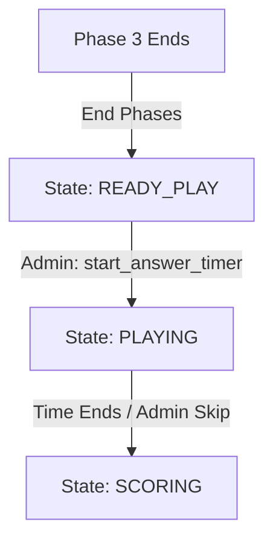

# Phase 01: Implementation of Labels and Timers

## Context Links
*   Brainstorm Report: [brainstormer-260625-1415-matrix-labels-and-timer.md](file:///Users/vinhcuong/Dev/gala-game/plans/reports/brainstormer-260625-1415-matrix-labels-and-timer.md)
*   State Machine: [matrix_game_state.py](file:///Users/vinhcuong/Dev/gala-game/backend/matrix_game_state.py)
*   Router: [matrix.py](file:///Users/vinhcuong/Dev/gala-game/backend/routers/matrix.py)
*   Display Component: [MatrixDisplay.tsx](file:///Users/vinhcuong/Dev/gala-game/frontend/src/components/display/MatrixDisplay.tsx)
*   Admin Controller: [MatrixController.tsx](file:///Users/vinhcuong/Dev/gala-game/frontend/src/components/admin/MatrixController.tsx)

## Overview
*   **Priority:** High
*   **Status:** Completed
*   **Goal:** Enhance the "Mò kim bể chữ" (Matrix) game by adding column/row coordinates and implementing a 7-minute countdown play period before showing the grading scores panel.

## Requirements
*   Add column/row labels (1-10) to the matrix grid.
*   Update game state machine to support `READY_PLAY` (preparation screen) and `PLAYING` (7-minute play countdown screen).
*   Add action buttons to start and stop the play timer in the Admin Page.

## Architecture

## Related Code Files
*   [matrix_game_state.py](file:///Users/vinhcuong/Dev/gala-game/backend/matrix_game_state.py)
*   [matrix.py](file:///Users/vinhcuong/Dev/gala-game/backend/routers/matrix.py)
*   [MatrixDisplay.tsx](file:///Users/vinhcuong/Dev/gala-game/frontend/src/components/display/MatrixDisplay.tsx)
*   [MatrixController.tsx](file:///Users/vinhcuong/Dev/gala-game/frontend/src/components/admin/MatrixController.tsx)

## Implementation Steps
1.  **Backend State Machine:**
    *   Change `end_phases()` to set `self.state = "READY_PLAY"`.
    *   Add `start_answer_timer(self, minutes)` to `MatrixGameStateMachine` class.
    *   Add `transition_to_scoring(self)` to transition the state to `"SCORING"`.
2.  **Backend Router:**
    *   Implement route `@router.post("/answer-time")` in `matrix.py` to trigger `matrix_game.start_answer_timer()`.
    *   Add route `@router.post("/end-timer")` in `matrix.py` to trigger `matrix_game.transition_to_scoring()`.
3.  **Display Component:**
    *   Modify [MatrixDisplay.tsx](file:///Users/vinhcuong/Dev/gala-game/frontend/src/components/display/MatrixDisplay.tsx) grid structure from `grid-cols-10` to `grid-cols-11`.
    *   Add row/column header labels mapping (1-10) using Tailwind CSS `.contents`.
    *   Add screens rendering for states `READY_PLAY` and `PLAYING`.
4.  **Admin Controller:**
    *   Update [MatrixController.tsx](file:///Users/vinhcuong/Dev/gala-game/frontend/src/components/admin/MatrixController.tsx) to render start/stop countdown controls when in states `READY_PLAY` and `PLAYING`.

## Todo List
- [x] Implement backend state transitions for `READY_PLAY` and `PLAYING`
- [x] Add backend endpoints in `routers/matrix.py`
- [x] Modify `MatrixDisplay.tsx` to render column/row labels (1-10)
- [x] Implement `READY_PLAY` and `PLAYING` screens in `MatrixDisplay.tsx`
- [x] Add countdown start/stop buttons in `MatrixController.tsx`
- [x] Verify types and build correctness

## Success Criteria
*   Grid shows `1` to `10` headers horizontally and vertically.
*   Clicking "Start 7m Timer" begins the 7-minute countdown on both Admin and Display.
*   Once finished/skipped, it enters the `SCORING` state.
