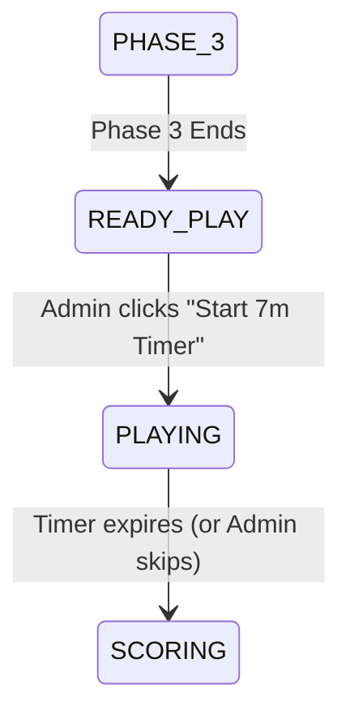

# Brainstorm: Grid Labels & 7-Minute Play Countdown for "Mò Kim Bể Chữ"

Evaluate and design implementation approaches for adding row/column labels (1-10) to the Matrix grid, inserting a preparation screen, adding a 7-minute countdown timer on the Admin page, and delaying the grading page display until after the timer expires.

## Problem Statement & Requirements
1.  **Grid Labels:** The 10x10 grid in the "Mò kim bể chữ" (Matrix) game needs to display column labels (1-10) at the top and row labels (1-10) on the left.
2.  **Waiting/Preparation Screen:** After the 1m30s matrix presentation phases end, show a waiting screen for teams to prepare instead of jumping straight to the scoring/grading screen.
3.  **7-Minute Countdown:** Add a button on the Admin page to start a 7-minute countdown. Both the Admin and Display pages should display this countdown.
4.  **Deferred Scoring:** The grading screen (`SCORING` state showing "ĐANG CHẤM ĐIỂM") must only appear *after* the 7-minute countdown completes (or is manually ended by the Admin).

---

## Technical Analysis & Proposed Solution

### 1. Matrix Grid Labels (Row/Col 1-10)
Instead of a standard 10x10 layout, we will render an 11x11 grid layout using Tailwind's `grid-cols-11` and CSS `display: contents` to flatten row-grouped cells:
*   **Column Headers Row:** Render an empty cell in the top-left, followed by numbers `1` through `10`.
*   **Data Rows:** For each row (0-9), render a row header showing `rIdx + 1`, followed by the 10 data cells.
*   **Styling:** Make row/col headers distinct (e.g., using `bg-purple-950/40`, colored borders, and a fixed opacity so they are not affected by visual effects of flickering).

---

### 2. State Machine Transitions (Backend)
Currently, `matrix_game_state.py` transitions immediately to `SCORING` after `PHASE_3` ends. We will introduce new states:
1.  `READY_PLAY`: Waiting screen. Matrix is hidden. Admin has a "Start 7m Timer" button.
2.  `PLAYING`: Countdown active. Large 7-minute clock displayed.
3.  `SCORING`: Display the grading screen.

**New/Modified Backend endpoints in [matrix.py](file:///Users/vinhcuong/Dev/gala-game/backend/routers/matrix.py):**
*   Modify `/api/matrix/answer-time` to start a timer (defaulting to 7 minutes) and transition state to `PLAYING`.
*   Add a new endpoint `/api/matrix/end-timer` to allow the Admin to force-end the timer early and transition to `SCORING`.

---

### 3. Controller UI Updates ([MatrixController.tsx](file:///Users/vinhcuong/Dev/gala-game/frontend/src/components/admin/MatrixController.tsx))
*   **READY_PLAY state:** Render a prominent button: `BẮT ĐẦU TÍNH GIỜ (7 PHÚT)` calling `/api/matrix/answer-time` with `{ minutes: 7 }`.
*   **PLAYING state:** Render the countdown timer alongside a `BỎ QUA / XÁC NHẬN HẾT GIỜ` button which calls `/api/matrix/end-timer`.
*   **SCORING state:** Render the existing grades selection panel.

---

### 4. Display UI Updates ([MatrixDisplay.tsx](file:///Users/vinhcuong/Dev/gala-game/frontend/src/components/display/MatrixDisplay.tsx))
*   **READY_PLAY state:** Render a waiting card: `PHẦN THI TIẾP SỨC - Đang chờ BTC bắt đầu tính giờ...`.
*   **PLAYING state:** Render a large, centered digital clock showing the 7-minute countdown (`timeLeft`).

---

## Implementation Considerations & Risks
*   **Grid Sizing:** Changing the layout from 10 to 11 columns shrinks the width of each cell slightly. We must ensure styling accommodates long words without overflow.
*   **Autoplay Audio:** If a background track is meant to play during the 7 minutes, we should check if there is an audio asset for it. Currently, `game1Audio` loops during phases 1, 2, and 3.

---

## Success Metrics & Validation
*   Grid shows `1` to `10` headers horizontally and vertically.
*   Matrix presentation transitions to a waiting screen.
*   Clicking "Start 7m Timer" kicks off the 7:00 countdown on both Admin and Display.
*   Timer completion triggers the "ĐANG CHẤM ĐIỂM" screen.
