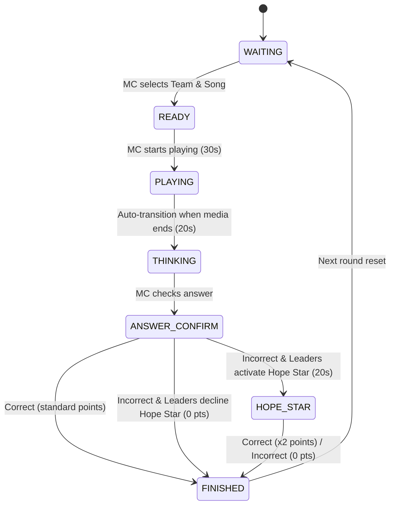

# Brainstorming Report: Game 2 (Giai điệu ngân nga) Rule Changes

## 1. Problem & Objectives
The user requested an adjustment to the rules and flow of **Game 2 (Giai điệu ngân nga / Humming)**:
1. **Genre + Year Hint from Start**: The hint (Dòng nhạc + Năm phát hành) is revealed at the beginning of the round.
2. **No Second Turn/Steal**: The standard teammate hint phase and other teams' steal phase are removed.
3. **Hope Star (Ngôi sao hy vọng) for Leaders**:
   - If the team answers incorrectly, leaders can activate the "Hope Star".
   - During the Hope Star phase, leaders can re-listen to the humming audio and see/know the singer's name.
   - If they guess correctly: the team gets **double points** (x2 points).
   - If they guess incorrectly: 0 points (no deduction, and other teams cannot steal).
4. **Timer Settings**:
   - Audio playing (Ngân nga): **30 seconds**.
   - Team thinking (Suy nghĩ): **20 seconds**.
   - Hope Star thinking (Lãnh đạo suy nghĩ): **20 seconds**.
5. **UI Updates**: Update the rules display, controller panel, and display screen to reflect the new flow.

---

## 2. Proposed System Design & Game Flow

We will introduce two new states to the `GameState` enum:
- `THINKING`: The 20s thinking period for the main team after the media stops playing.
- `HOPE_STAR`: The 20s thinking period for the team leaders using the Hope Star.

### State Transitions Workflow

---

## 3. Database & Model Schema Updates

### Table: `songs`
We will add a new column `singer` to store the artist's name, which is revealed only during the Hope Star phase.
- **Migration**: `ALTER TABLE songs ADD COLUMN singer TEXT DEFAULT '';`
- **Models to Update**:
  - `SongCreate`, `SongUpdate`, `SongResponse` in `backend/models.py`.
- **CSV Import Update**:
  - Columns in CSV: `STT | Đội | Tên bài hát | Dòng nhạc + Năm phát hành | Ca sĩ | Type | Filename`
  - Read `row[3]` as `hint` (Genre + Year).
  - Read `row[4]` as `singer` (Ca sĩ).

---

## 4. UI/UX & Rules Display

### A. Rules Display Screen (Display Page)
Update the rules slide content for Game 2:
- **Title**: Giai điệu ngân nga (Humming)
- **Rules Text**:
  - Mỗi đội nghe 1 bản nhạc ngân nga (30 giây) dưới sự trợ giúp của gợi ý **Dòng nhạc + Năm phát hành** từ ban đầu.
  - Đội có **20 giây** suy nghĩ để đưa ra tên bài hát. Trả lời đúng nhận **10 điểm** (Nhạc Live nhận **20 điểm**).
  - Nếu sai, lãnh đạo có quyền kích hoạt **Ngôi sao hy vọng** để nghe lại bản ngân và nhận thêm gợi ý **Tên ca sĩ**.
  - Trả lời đúng ở lượt Ngôi sao hy vọng nhận **nhân đôi điểm** (20 điểm hoặc 40 điểm). Trả lời sai không bị trừ điểm, đội khác không được cướp câu.

### B. MC / Admin Controller (`HummingController.tsx`)
- Display the **Genre + Year Hint** from the start (`READY`, `PLAYING`, `THINKING`).
- Add a countdown timer for:
  - Play (30s)
  - Thinking (20s)
  - Hope Star (20s)
- If the main answer is marked as "Wrong", display two options:
  - **Kích hoạt Ngôi sao hy vọng** (Transitions to `HOPE_STAR` state, starts 20s timer, plays audio, reveals singer name).
  - **Không dùng / Bỏ qua** (Transitions straight to `FINISHED` with 0 points).
- In `HOPE_STAR` state, display the singer's name to the MC and buttons to check correctness (ĐÚNG -> x2 points, SAI -> 0 points).

### C. Display Page (`HummingDisplay.tsx`)
- Show the **Genre + Year Hint** throughout the round.
- In `HOPE_STAR` state, show a premium visual effect:
  - Big pulsing "NGÔI SAO HY VỌNG" text/banner.
  - Reveal the singer's name on the display screen.
  - Play humming audio again.
  - Run the 20s leader countdown timer.
