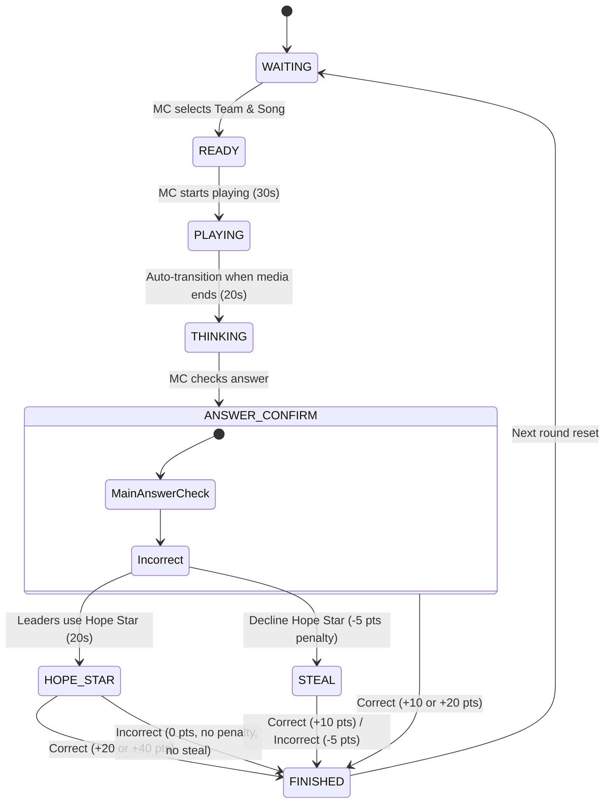

# Brainstorming Report: Game 2 Adjusted Rules & Scoring Flow

## 1. Problem & Objectives
The user adjusted the rules for Game 2 (Giai điệu ngân nga / Humming) to introduce a strategic branch when the main team answers incorrectly:

- **Branch A: Use Hope Star (Kích hoạt Ngôi sao hy vọng)**
  - If leaders guess **CORRECTLY**: +x2 points (e.g. +20 points for normal song, +40 points for live song). No points deducted from the original incorrect guess.
  - If leaders guess **INCORRECTLY**: 0 points total (no points deducted for either the original incorrect guess or the Hope Star guess). Other teams **cannot** steal.
  
- **Branch B: Decline Hope Star (Không dùng Ngôi sao hy vọng)**
  - The playing team is immediately **penalized** (e.g. -5 points).
  - The round transitions to the **STEAL (Cướp điểm)** phase where other teams can steal the points (+10 points for correct steal, -5 points for incorrect steal).

---

## 2. Updated State Machine & Transition Flow

We will reuse/define these states for Game 2:
- `WAITING`: MC selects team and song.
- `READY`: Preparing to play.
- `PLAYING`: Music plays (30s timer).
- `THINKING`: Main team thinking time (20s timer).
- `ANSWER_CONFIRM`: MC verifies the main team's guess.
- `HOPE_STAR`: Leaders think under the Hope Star (20s timer, re-listen, singer name revealed).
- `STEAL`: Other teams try to steal the points (after Hope Star is declined).
- `FINISHED`: Round complete, score saved.

---

## 3. Score Matrix Summary

| Phase / Scenario | Playing Team Score | Stealing Team Score | Steal Phase Triggered? |
| :--- | :--- | :--- | :--- |
| **Main Answer Correct** | **+10** (Live: **+20**) | 0 | No |
| **Main Answer Incorrect & Use Hope Star (Correct)** | **+20** (Live: **+40**) | 0 | No |
| **Main Answer Incorrect & Use Hope Star (Incorrect)** | **0** | 0 | No |
| **Main Answer Incorrect & Decline Hope Star (Steal Correct)** | **-5** | **+10** | Yes |
| **Main Answer Incorrect & Decline Hope Star (Steal Incorrect)** | **-5** | **-5** | Yes |

---

## 4. UI/UX & Controller Actions

### MC Admin Controller Panel
When the main answer is checked as "Wrong", the admin panel will display:
1. **Dùng Ngôi sao hy vọng**: Trạng thái chuyển sang `HOPE_STAR`, hiện nút phát lại nhạc, hiện tên ca sĩ gợi ý, chạy timer 20 giây. MC có nút chấm Đúng/Sai cho lãnh đạo.
2. **Không dùng (Bị trừ điểm & Cho cướp)**: Trực tiếp trừ 5 điểm của đội chơi, chuyển trạng thái sang `STEAL` để các đội còn lại bấm cướp điểm.
