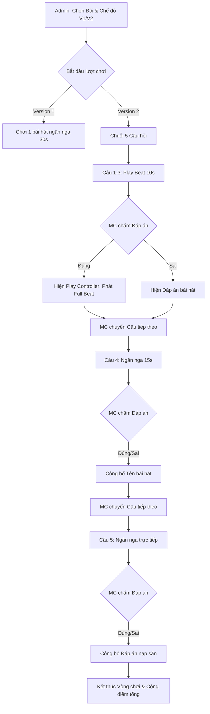

# Brainstorm: Giai Điệu Vượt Ngàn - Version 2

Phân tích và đề xuất giải pháp thiết kế cho Version 2 của Game 2 "Giai điệu vượt ngàn", trong đó giữ nguyên Version 1 và bổ sung chế độ chơi mới với 5 câu hỏi mỗi đội (3 câu nghe Beat 10s, 1 câu nghe Ngân nga 15s, 1 câu Ngân nga trực tiếp).

---

## 1. Yêu cầu chi tiết & Phân tích nghiệp vụ

### Giao diện và cấu trúc vòng chơi (Version 2)
Mỗi đội thi đấu sẽ thực hiện chuỗi 5 câu hỏi liên tục:
1. **Câu 1 - 3 (Play Beat 10s):**
   - Nạp file MP3 full beat.
   - Khi phát nhạc, hệ thống tự động ngắt/dừng ở giây thứ **10**.
   - Người chơi đoán tên bài hát.
   - Nếu trả lời **ĐÚNG**: hiển thị bộ điều khiển (Play Controller) trên màn hình máy chiếu (Display) và bảng điều khiển (Admin) để có thể phát Full Beat cho cả hội trường nghe.
2. **Câu 4 (Humming 15s - MP3/MP4):**
   - Nạp file MP3 hoặc MP4 ngân nga (giống Game 2 hiện tại).
   - Hệ thống tự động ngắt/dừng ở giây thứ **15**.
   - Nếu trả lời **ĐÚNG**: công bố tên bài hát/đáp án.
3. **Câu 5 (Ngân nga trực tiếp - Live Humming):**
   - Không phát nhạc từ hệ thống (Lãnh đạo hoặc MC ngân nga trực tiếp trên sân khấu).
   - Hiển thị màn hình chờ trực quan (microphone/live icon).
   - Đáp án được nạp trước vào hệ thống.
   - Nếu trả lời **ĐÚNG**: công bố tên bài hát/đáp án.

### Nguyên tắc tích hợp & Bảo toàn
- **Bảo toàn Version 1:** Người dùng vẫn có thể chọn chơi giữa Version 1 (luật chơi cũ) hoặc Version 2 thông qua giao diện Admin.
- **Tính điểm:** Thiết lập cơ chế cộng điểm linh hoạt cho Version 2 (ví dụ: +10 điểm cho mỗi câu trả lời đúng, hoặc cấu hình riêng).

---

## 2. Đánh giá các phương án thiết kế (Trade-off Analysis)

### Phương án A: Tách riêng bảng dữ liệu và luồng API mới (`humming_v2`)
* **Mô tả:** Tạo bảng `songs_v2`, `humming_rounds_v2` và router `/api/humming-v2` riêng biệt để cô lập hoàn toàn logic.
* **Ưu điểm:**
  - An toàn tuyệt đối cho Version 1, không sợ ảnh hưởng đến code cũ.
  - Dễ code độc lập, không cần câu lệnh điều kiện `if-else` phức tạp trong các file hiện tại.
* **Nhược điểm:**
  - Vi phạm nguyên tắc **DRY** (Don't Repeat Yourself). Copy-paste rất nhiều code React và Python tương đồng.
  - Phình to database và code size (>200 dòng/file), khó bảo trì sau này nếu cần sửa hiệu ứng hoặc sửa điểm chung.

### Phương án B: Tích hợp chung bảng, thêm trường phân loại (Khuyên dùng)
* **Mô tả:** Sử dụng lại bảng `songs` và `humming_rounds` hiện có. Bổ sung thêm các trường:
  - `game_version` (1 hoặc 2) trong bảng `songs` và `sessions`/`humming_rounds`.
  - `question_number` (1 đến 5) để đánh dấu thứ tự câu hỏi trong Version 2.
  - `question_type` (`beat`, `humming`, `live`) để xử lý logic phát nhạc tương ứng.
* **Ưu điểm:**
  - Tận dụng 90% logic WebSocket sync, quản lý session, và giao diện máy chiếu hiện tại.
  - Dễ dàng import CSV chung hoặc riêng bằng cách thêm cột phân loại.
  - Đáp ứng nguyên tắc **KISS** và **YAGNI**.
* **Nhược điểm:**
  - Cần chỉnh sửa một số hàm xử lý trạng thái phát nhạc (auto-pause tại 10s/15s) và hiển thị tương ứng.

---

## 3. Kiến trúc chi tiết (Phương án B)

### 3.1. Database Schema Migrations (`database.py`)
Bổ sung các trường vào bảng hiện tại để hỗ trợ Version 2:
```sql
-- Thêm cột vào bảng songs để phân loại câu hỏi
ALTER TABLE songs ADD COLUMN game_version INTEGER DEFAULT 1; -- 1: V1, 2: V2
ALTER TABLE songs ADD COLUMN question_number INTEGER DEFAULT 0; -- 1 -> 5 (cho V2)
ALTER TABLE songs ADD COLUMN question_type TEXT DEFAULT 'humming'; -- 'beat', 'humming', 'live'

-- Thêm cột vào bảng humming_rounds để lưu vết lượt chơi
ALTER TABLE humming_rounds ADD COLUMN game_version INTEGER DEFAULT 1;
ALTER TABLE humming_rounds ADD COLUMN current_question_number INTEGER DEFAULT 1;
```

### 3.2. Cải tiến State Machine (`humming_game_state.py`)
State Machine của Humming Game cần quản lý thêm trạng thái câu hỏi hiện tại của Version 2:
- `current_question_number`: Số thứ tự câu hiện tại (1 -> 5).
- `reveal_full_player`: `True` nếu đoán đúng Q1-Q3, cho phép hiển thị và điều khiển full audio player.
- Logic auto-pause qua WebSocket:
  - Khi phát nhạc:
    - Nếu `question_type == 'beat'`, Frontend/Backend giới hạn thời gian phát tối đa 10s.
    - Nếu `question_type == 'humming'`, giới hạn 15s.
  - Khi MC xác nhận **ĐÚNG** ở câu hỏi Beat (`question_type == 'beat'`), chuyển `reveal_full_player` thành `True` để mở trình phát nhạc đầy đủ.

### 3.3. Luồng Giao Diện (UI/UX Flow)



---

## 4. Kế hoạch thay đổi mã nguồn (File Changes)

### Backend

#### [MODIFY] [database.py](file:///Users/macintoshhd/VNPT_Project/TeamBuilding_Tam-Sao-That-Ban/backend/database.py)
- Bổ sung lệnh migrations `ALTER TABLE` để thêm các trường `game_version`, `question_number`, `question_type` một cách an toàn.

#### [MODIFY] [models.py](file:///Users/macintoshhd/VNPT_Project/TeamBuilding_Tam-Sao-That-Ban/backend/models.py)
- Cập nhật `SongCreate`, `SongUpdate`, `SongResponse` và `GameStateResponse` để truyền tải các trường mới qua API và WebSocket.

#### [MODIFY] [humming_game_state.py](file:///Users/macintoshhd/VNPT_Project/TeamBuilding_Tam-Sao-That-Ban/backend/humming_game_state.py)
- Thêm thuộc tính `game_version` và `current_question_number` trong state.
- Cập nhật `start_round` để tìm nạp chuỗi 5 bài hát được gán cho Đội tương ứng nếu là Version 2.
- Sửa đổi hàm `confirm_answer` để lưu điểm tích lũy của từng câu và chuyển tiếp trạng thái câu tiếp theo thay vì kết thúc vòng chơi ngay lập tức (cho đến khi hoàn thành câu 5).
- Thêm API/State `reveal_full_player` và điều khiển phát nhạc full beat.

#### [MODIFY] [songs.py](file:///Users/macintoshhd/VNPT_Project/TeamBuilding_Tam-Sao-That-Ban/backend/routers/songs.py)
- Cập nhật API Import CSV để hỗ trợ các cột phân loại mới (`game_version`, `question_number`, `question_type`).

---

### Frontend

#### [MODIFY] [SongManager.tsx](file:///Users/macintoshhd/VNPT_Project/TeamBuilding_Tam-Sao-That-Ban/frontend/src/components/admin/SongManager.tsx)
- Thêm trường lựa chọn `Version` (1 hoặc 2) khi tạo/sửa bài hát.
- Nếu chọn Version 2, cho phép cấu hình `Question Number` (1-5) và `Question Type` (Beat / Ngân nga / Trực tiếp).

#### [MODIFY] [HummingController.tsx](file:///Users/macintoshhd/VNPT_Project/TeamBuilding_Tam-Sao-That-Ban/frontend/src/components/admin/HummingController.tsx)
- Thêm dropdown/toggle chọn Version (V1 hoặc V2) khi ở trạng thái `WAITING`.
- Cập nhật giao diện điều phối cho Version 2:
  - Hiển thị danh sách 5 câu hỏi của đội đang thi.
  - Các nút điều khiển phát nhạc (tự động đếm 10s cho Beat, 15s cho Ngân nga).
  - Khi câu trả lời của Q1-Q3 ĐÚNG, hiển thị Audio Player đầy đủ (Play, Pause, Progress Bar) để MC bấm phát/dừng nhạc tùy ý.
  - Nút "Câu tiếp theo" để chuyển đổi trạng thái câu hỏi từ 1 -> 5.

#### [MODIFY] [HummingDisplay.tsx](file:///Users/macintoshhd/VNPT_Project/TeamBuilding_Tam-Sao-That-Ban/frontend/src/components/display/HummingDisplay.tsx)
- Chỉnh sửa logic tự động ngắt phát media ở giây thứ 10 (cho câu 1-3) và giây 15 (cho câu 4).
- Cập nhật giao diện hiển thị máy chiếu:
  - Khi Q1-Q3 trả lời đúng: Hiển thị giao diện đĩa nhạc kèm thanh điều khiển phát nhạc đầy đủ để cả hội trường theo dõi.
  - Khi câu 5 hoạt động: Hiển thị màn hình Live Humming bắt mắt với biểu tượng Microphone lớn và thông báo Lãnh đạo chuẩn bị biểu diễn.

---

## 5. Kế hoạch Kiểm thử & Xác minh (Verification Plan)

### Kiểm thử tự động
- Viết unit test cho hàm `start_round` và `confirm_answer` của Version 2 trên backend nhằm bảo đảm điểm số được cộng đúng lũy tiến và chuyển câu hỏi đúng trình tự.
- Test trường hợp file CSV import không đúng định dạng cột Version 2.

### Kiểm thử thủ công
1. **Kiểm tra Version 1:** Chạy thử 1 lượt chơi ở chế độ Version 1, xác nhận luật chơi, âm thanh, tính điểm không có gì thay đổi so với hiện tại.
2. **Kiểm tra phát nhạc tự động ngắt:** 
   - Phát thử Q1-Q3 ở Version 2, kiểm tra âm thanh dừng chính xác ở giây thứ 10.
   - Phát thử Q4 ở Version 2, kiểm tra dừng chính xác ở giây thứ 15.
3. **Kiểm tra phát full beat:** Trả lời đúng Q1, kiểm tra nút Phát Full Beat xuất hiện trên Admin và phát nhạc bình thường qua giây thứ 10 trên Display.
4. **Kiểm tra hiển thị Live:** Chọn câu 5, kiểm tra máy chiếu hiện giao diện live, không phát file âm thanh cũ nào.
